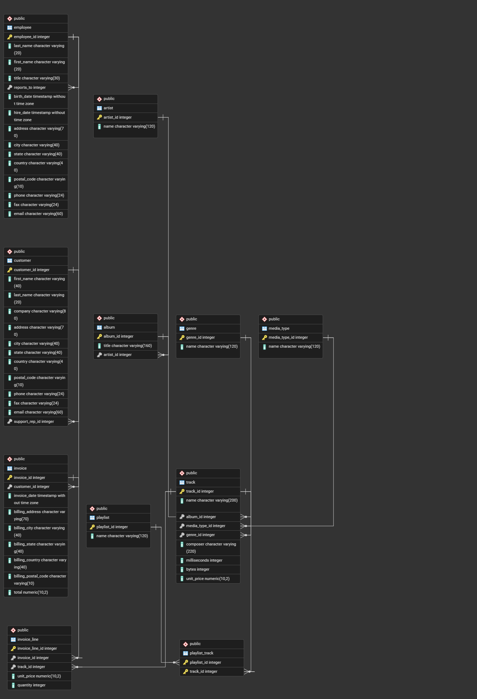

# Chinook Music Store — SQL Analysis

A business-focused SQL analysis of a digital music store using the **Chinook database**. This project answers real business questions across 6 progressive levels — from basic exploration to advanced analytics — using PostgreSQL.

> **Dataset:** 59 customers · 412 invoices · 3,503 tracks · 24 countries · 2021–2025

---

## Business Questions Answered

- Which countries and customers generate the most revenue?
- What genres and artists drive the most sales?
- Which tracks generate the most revenue?
- How concentrated is revenue among our top customers?
- Which markets have the highest average customer value?
- How are customers segmented by spending and purchase behavior?
- Is the business growing month over month?
- Which sales agents perform best?
- What does customer retention look like across years?

---

## Project Structure

```
chinook-sql-analysis/
├── assets/
│   └── erd.png
│
├── queries/
│   ├── level_1_basic_select.sql
│   ├── level_2_aggregations.sql
│   ├── level_3_joins.sql
│   ├── level_4_ctes.sql
│   ├── level_5_window_functions.sql
│   └── level_6_business_analytics.sql
│
├── findings/
│   └── findings.md
│
└── README.md
```

---

## Database Schema

The Chinook database represents a digital music store with the following key tables:

| Table          | Description                                          |
| -------------- | ---------------------------------------------------- |
| `customer`     | Customer info — name, country, assigned support rep  |
| `invoice`      | Purchase records — date, total, billing country      |
| `invoice_line` | Line items per invoice — track, quantity, unit price |
| `track`        | Track details — name, album, genre, price            |
| `album`        | Albums linked to artists                             |
| `artist`       | Artist names                                         |
| `genre`        | Music genres                                         |
| `employee`     | Staff, including Sales Support Agents                |

### Entity Relationship Diagram



---

## Queries

All SQL files are in the `queries/` folder, organized by complexity:

| File                             | Level              | Skills                                              |
| -------------------------------- | ------------------ | --------------------------------------------------- |
| `level_1_basic_select.sql`       | Basic SELECT       | `SELECT`, `WHERE`, `ORDER BY`, `LIMIT`, `COUNT`     |
| `level_2_aggregations.sql`       | Aggregations       | `SUM`, `AVG`, `COUNT`, `GROUP BY`                   |
| `level_3_joins.sql`              | Joins              | `JOIN` across 2–4 tables                            |
| `level_4_ctes.sql`               | CTEs               | `WITH`, `CROSS JOIN`, `DATE_TRUNC`, `DISTINCT ON`   |
| `level_5_window_functions.sql`   | Window Functions   | `RANK()`, `ROW_NUMBER()`, `SUM() OVER`, `CASE WHEN` |
| `level_6_business_analytics.sql` | Business Analytics | `LAG()`, `HAVING`, `EXTRACT`, `PARTITION BY`        |

---

## Key Findings Summary

| Area                   | Finding                                                                            |
| ---------------------- | ---------------------------------------------------------------------------------- |
| Total revenue          | $2,328.60 across 412 invoices                                                      |
| Top market             | USA - $523.06 (~22.5% of total revenue)                                            |
| Top customer           | Helena Holý - $49.62 lifetime spend                                                |
| Top genre              | Rock - $826.65 (dominates globally)                                                |
| Top artist             | Iron Maiden - $138.60 in revenue                                                   |
| Top track              | 8 TV episodes tied at $3.98 as highest-earning; top music tracks earn $1.98        |
| Customer concentration | Top 10 customers = ~19.4% of revenue                                               |
| Highest value market   | Chile - $46.62 avg spending per customer                                           |
| Customer segmentation  | 100% of customers are Regular buyers - nearly all made exactly 7 purchases         |
| Revenue trend          | Largely flat at ~$37.62/month across 2021-2025, peak at $52.62 (Jan 2022)          |
| Top sales agent        | Jane Peacock - $833.04                                                             |
| Customer retention     | 100% of customers active across multiple years - 63% purchased in 4 out of 5 years |

> See [`findings/findings.md`](findings/findings.md) for the full analysis and business recommendations.

---

## How to Run

1. Download the Chinook database (PostgreSQL version): https://github.com/lerocha/chinook-database

2. Load it into PostgreSQL:

```bash
   psql -U postgres -f chinook_postgresql.sql
```

3. Open any `.sql` file from the `queries/` folder and run it in your SQL client (pgAdmin).

> Some queries use PostgreSQL-specific syntax (`DATE_TRUNC`, `DISTINCT ON`, `EXTRACT`). Adjustments may be needed for MySQL or SQLite.

---

## Tools Used

- **Database:** PostgreSQL
- **SQL Client:** pgAdmin
- **Dataset:** [Chinook Database](https://github.com/lerocha/chinook-database)
- **AI Assistance:** Claude (Anthropic) — used to help interpret results and structure findings. All SQL queries were written independently.

---

## SQL Concepts Covered

| Concept             | Keywords Used                                              |
| ------------------- | ---------------------------------------------------------- |
| Filtering & sorting | `WHERE`, `ORDER BY`, `LIMIT`                               |
| Aggregation         | `SUM`, `AVG`, `COUNT`, `GROUP BY`                          |
| Multi-table joins   | `JOIN` across 2–4 tables                                   |
| Reusable subqueries | `WITH` (CTEs), `CROSS JOIN`                                |
| Window functions    | `RANK()`, `ROW_NUMBER()`, `LAG()`, `SUM() OVER`            |
| Segmentation        | `CASE WHEN`, `PARTITION BY`, `HAVING`                      |
| Time series         | `DATE_TRUNC`, `EXTRACT`, month-over-month growth           |
| Business analytics  | LTV, retention, revenue concentration, behavioral segments |
